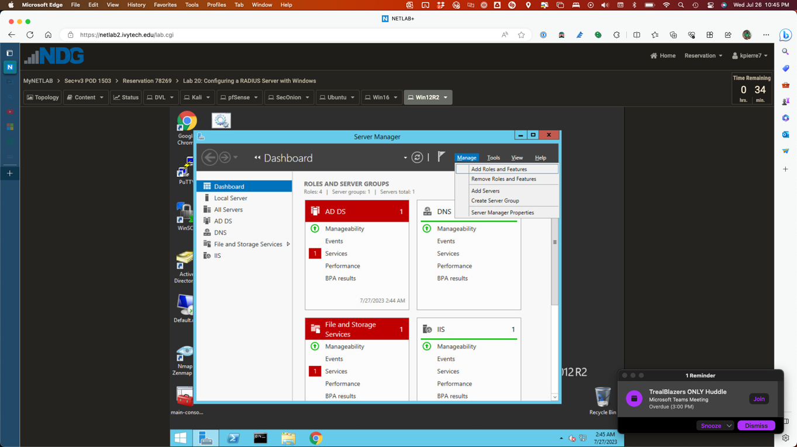
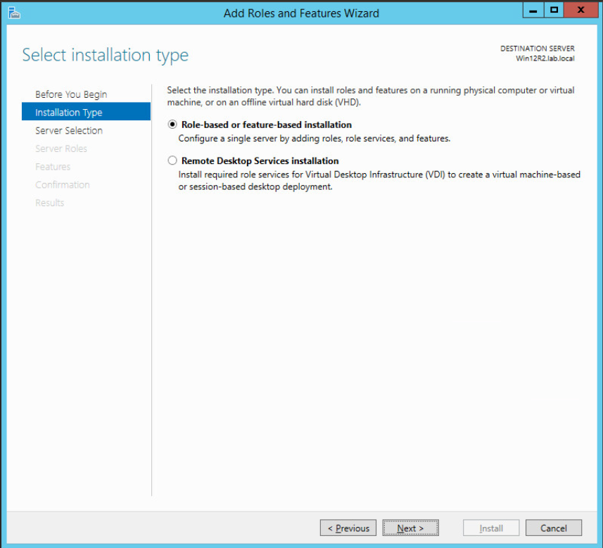
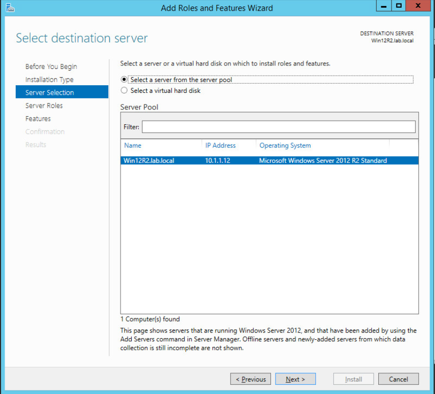
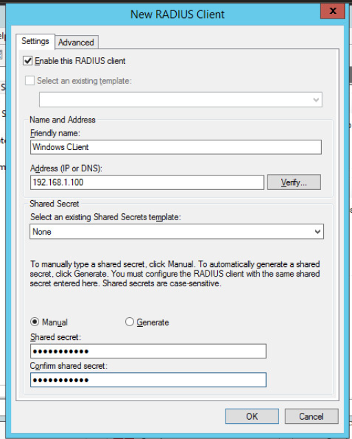

Lab 20: Configuring a RADIUS server with Windows

1\. Add the Network Policy Server role

In this task, you will add the role of Network Policy Server to the
Win12R2 server. You will then add the Network Policy and Access Services
Tools.

1\. Launch the Win12R2 virtual machine to access the graphical login
screen.

2\. While on the splash screen, focus on the NETLAB+ tabs. Click the
drop-down menu for the Win12R2 tab and click on Send CTRL+ALT+DEL

3\. Log in as Administrator using the password Train1ng\$.

>  alt="A person in a lab coat Description automatically generated" />
>
> 4\. Notice a Server Manager window appears upon bootup. In the Server
> Manager window, click on Manage in the top-right corner and select Add
> Roles and Features.
>
>  alt="A screenshot of a computer Description automatically generated" />
>
> 5\. Notice the Add Roles and Features Wizard appears. Review the
> Before you begin page and click Next to
> continue. alt="A screenshot of a computer program Description automatically generated" />
>
> 6\. n the Installation Type step, keep the default setting of
> Role-based or featurebased Installation and click Next.
>
>  alt="A screenshot of a computer Description automatically generated" />

7\. On the Server Selection step, select the Win12R2.lab.local server
from the pool and click Next.

>  alt="A screenshot of a computer Description automatically generated" />
>
> 8\. On the Server Roles step, check the checkbox for Network Policy
> and Access Services and notice a pop-up window appears. Click the Add
> Features button.
>
>  alt="A screenshot of a computer Description automatically generated" />
>
> 9\. Back on the main wizard window, ensure that Network Policy and
> Access Services is checked and click Next.
>
>  alt="A screenshot of a computer Description automatically generated" />

10\. On the Features step, leave the defaults and click Next.

11\. On the Network Policy and Access Services step, review the
information and click Next.

12\. On the Role Services step, ensure that Network Policy Server is
checked and click Next.

13\. On the Confirmation step, click Install to finish the installation
of the Network Policy Server.

> 14\. The installation will take about 3 minutes. After the install is
> complete, click Close.
>  alt="A screenshot of a computer Description automatically generated" />

15\. Leave the Win12R2 window open to continue with the next task.

2\. Configure the Network Policy Server

1\. Back on the Server Manager window, navigate to Tools \> Network
Policy Server.

2\. In the Network Policy Server window, in the left pane, right-click
on NPS (Local) and select Register Server in Active Directory.

3\. When prompted to authorize, click OK to continue.

4\. Click OK again to confirm that the system is now authorized.

5\. Expand the RADIUS Clients and Servers inventory object, right-click
on RADIUS Clients and click New.

6\. In the New RADIUS Client window, fill in the following information:
a. Friendly name: Windows Client b. Address: 192.168.1.100 c. Shared
secret: password123 d. Confirm shared secret: password123

7\. Once the configurations are made, click OK.

8\. Select RADIUS Clients from the left pane and verify that Windows
Client appears in the right pane and that it is enabled.

9\. Now it is time to create a new network policy. In the left pane,
expand Policies, right-click on Network Policies and select New.

10\. In the New Network Policy window, type Remote Access RADIUS in the
Policy name text field and click Next.

11\. On the Specify Conditions step, click the Add button.

12\. In the Select condition window, scroll down and select Access
Client IPv4 Address and click Add.

13\. When prompted for an IPv4 address, type 192.168.1.100 and click OK.

14\. Back on the Specify Conditions step, ensure that the new condition
is listed and click Next.

15\. On the Specify Access Permission step, leave the Access granted
selected and click Next.

16\. On the Configure Authentication Methods step, leave the default
settings and click Next.

17\. On the Configure Constraints step, leave the default settings and
click Next.

18\. On the Configure Settings step, leave the defaults and click Next.

19\. On the Completing New Network Policy step, click Finish. You now
have a new network policy for the RADIUS client.

20\. Back on the Network Policy Server window, in the left pane, click
on Network Policies and confirm the new policy appears in the right
pane.

21\. The lab is now complete; you may end the reservation.
